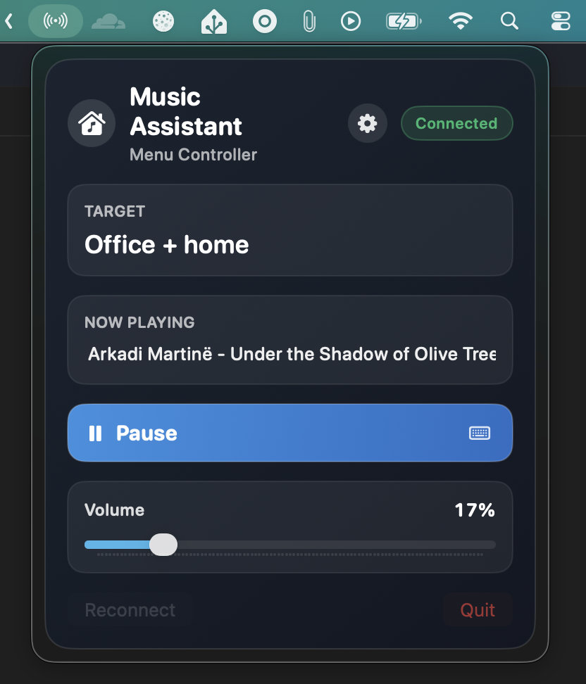

# Music Assistant Menu Bar (macOS)

Minimal menu bar controller for a Music Assistant server.

## Screenshot



## Features (v1)

- Menu bar-only app (no dock icon via accessory activation policy)
- WebSocket API client (`ws://<host>:<port>/ws`)
- Configurable API host + port
- Token input with permanent Keychain storage
- Bonjour auto-discovery (`_music-assistant._tcp` then `_home-assistant._tcp`)
- Auto target selection:
  - Prefer currently playing group player
  - Else currently playing non-synced coordinator
  - Else last successful target
- Previous/Play-Pause/Next transport controls
- Play/Pause button label reflects current state (`Play` when paused/idle, `Pause` when playing)
- Volume slider (0-100)
  - Group target: `players/cmd/group_volume`
  - Normal player: `players/cmd/volume_set`
- Now Playing line with marquee scrolling for long track text
- Global hardware Play/Pause media-key listener (native, no dependencies)
- Exclusive Play/Pause key capture via `CGEventTap` when permissions allow
- Automatic reconnect with backoff

## Run

```bash
swift run MusicAssistantMenuBar
```

## Build

```bash
swift build
```

## Signed Build Script

Use `build.sh` for a signed distributable `.app` and `.zip` (outside Mac App Store):

```bash
./build.sh
```

Optional environment variables:

- `SIGN_APP` (default: `1`; set `0` to skip code signing for CI/dev artifacts)
- `SIGNING_IDENTITY` (optional; auto-detected when possible)
- `APP_NAME` (default: `MusicAssistantMenuBar`)
- `PRODUCT_NAME` (default: `MusicAssistantMenuBar`)
- `APP_ICON_PATH` (default: `Assets/AppIcon.icns`)
- `BUNDLE_ID` (default: `io.example.musicassistant.menubar`)
- `VERSION` (default: `1.0.0`)
- `BUILD_NUMBER` (default: `1`)
- `OUTPUT_DIR` (default: `dist`)
- `SIGNING_KEYCHAIN` (path to a specific keychain)
- `SIGNING_CERT_P12_BASE64` (optional; base64-encoded `.p12` for CI import)
- `SIGNING_CERT_PASSWORD` (required when `SIGNING_CERT_P12_BASE64` is set)
- `CI_KEYCHAIN_PASSWORD` (optional; temp keychain password)
- `NOTARIZE=1` to notarize
  - Use `NOTARY_PROFILE` (recommended), or
  - `APPLE_ID`, `APPLE_APP_SPECIFIC_PASSWORD`, `APPLE_TEAM_ID`

Artifacts are written to `dist/`.

## Publishing

<details>
<summary><strong>Publishing Instructions (Click to Expand)</strong></summary>

GitHub Actions workflow: `.github/workflows/build.yml`

- Every push/PR builds on macOS and uploads an unsigned `.app` + `.zip` as workflow artifacts
- Tag pushes with prefix `v` (for example `v1.2.3`) build a signed app and publish `${APP_NAME}-${tag}.app.zip` to GitHub Releases

To use signing in CI, export your certificate:

1. Open `Keychain Access` -> `login` -> `My Certificates`.
2. Find `Developer ID Application: ...`.
3. Right click -> `Export ...` -> save as `.p12` with a password.
4. Convert to base64:

```bash
base64 -i /path/to/DeveloperID.p12 | pbcopy
```

Set repository secrets:

- `SIGNING_CERT_P12_BASE64`
- `SIGNING_CERT_PASSWORD`
- `SIGNING_IDENTITY` (optional, recommended)
- `CI_KEYCHAIN_PASSWORD` (optional)

Optional notarization secrets:

- `NOTARIZE=1`
- `NOTARY_PROFILE` (recommended), or `APPLE_ID` + `APPLE_APP_SPECIFIC_PASSWORD` + `APPLE_TEAM_ID`

Optional repository variable:

- `BUNDLE_ID` (defaults to `io.example.musicassistant.menubar`)

Create a release:

```bash
git tag v1.0.0
git push origin v1.0.0
```

</details>

## Notes

- Host/port are saved in `UserDefaults` and token is saved in Keychain.
- Use the gear button in the menu panel to configure host/port/token and connect.
- To fully block Apple Music from launching on Play/Pause, grant Accessibility/Input Monitoring permissions to the app process. Without permissions, the app falls back to passive key monitoring.
- The permission warning includes quick actions: `Allow Access`, `Open Settings`, and `Retry`.
